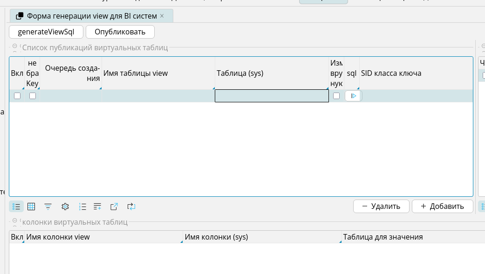
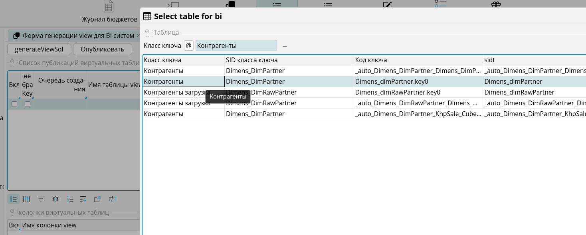
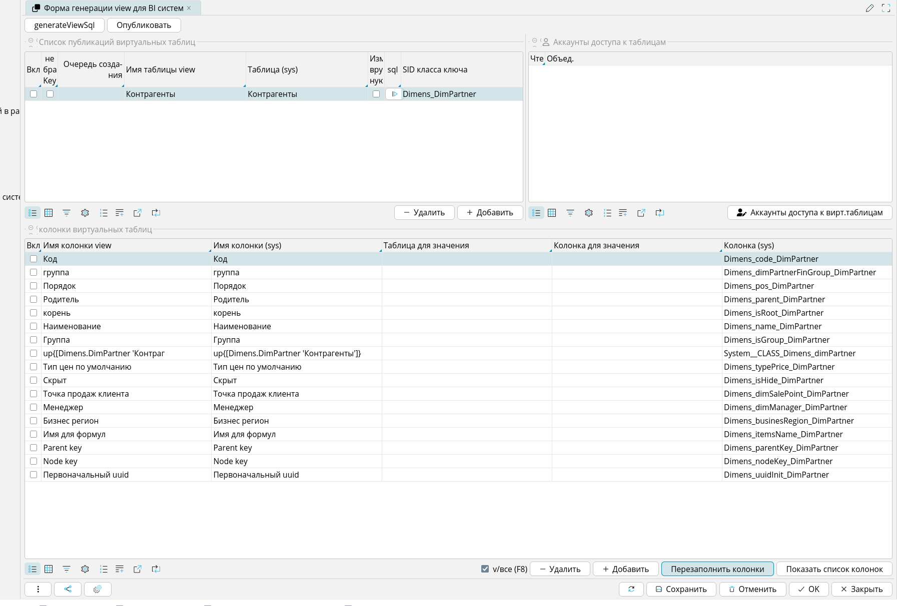
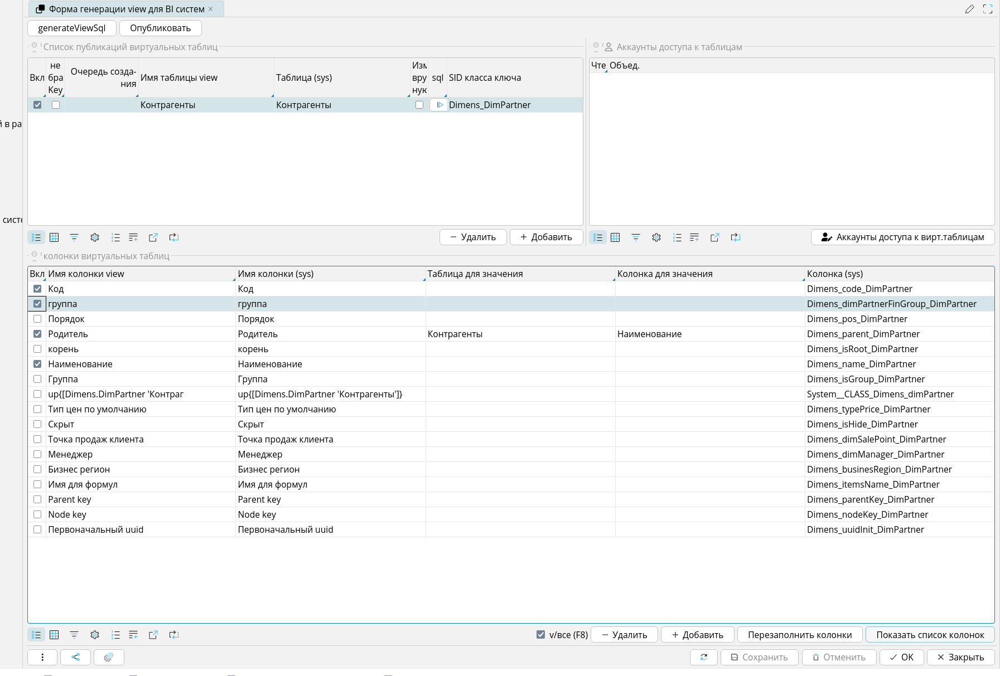
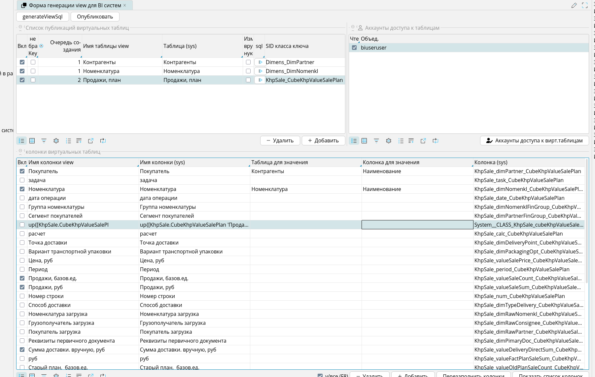
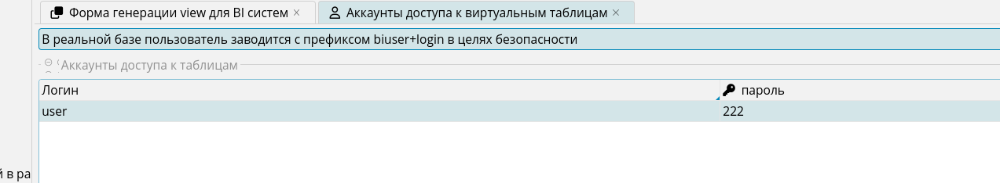
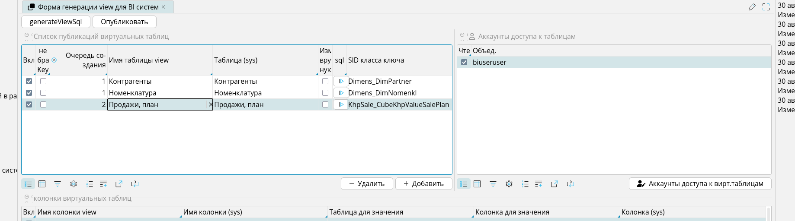
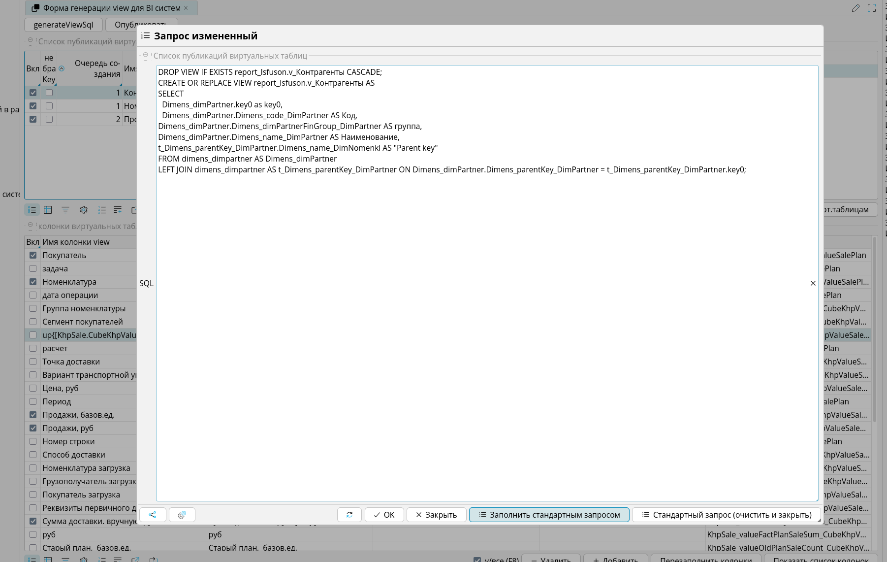
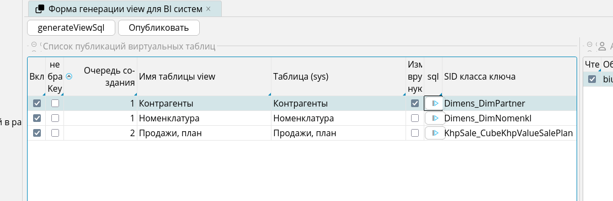
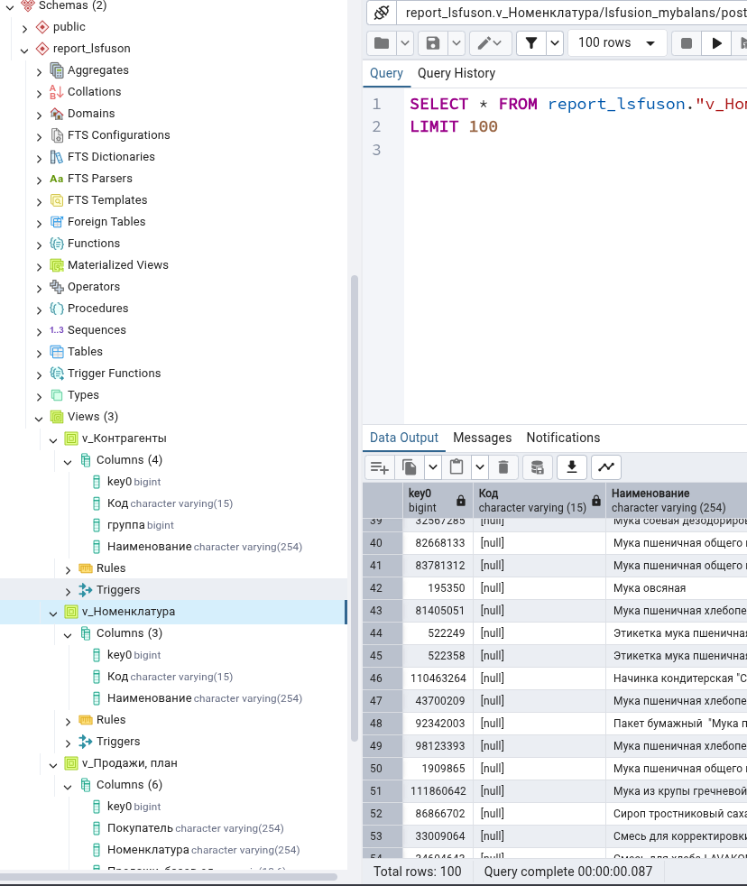

# Использование
1. В списке публикаций добавьте строку и выберите в поле Таблица (sys)
 


таблицу из системного списка lsfusion reflection



2. Кнопкой "Перезаполнить колонки" - заполните список колонок в нижней таблице



3. Включите галочку в верхней таблице и галочки напротив необходимых полей в нижней таблице



4. можно добавлять новые поля, и заменять их значения простыми lookup полями
   
(делается левое соединание - должны быть уникальны значения)

более сложные запросы или делаются на стороне bi систем - или можно вставить код view принудительно
нажав в верхней таблице в строке команду в колонке SQL. В последнем случае корректность выполняемого кода 
на стороне заполянющего (внимание!! небезопасно: код не проверяется - выполняется в текущей рабочей базе все что там написано)

5. В верхней таблице справа добавьте пользователя базы postgres для просмотра view





и проставьте галочку на чтение для всех таблиц

 

6. Генерируемый скрипт можно посмотреть по кнопочке generateViewSql
7. Выполнить в рабочей базе (в которой работаете) можно по кнопочке Опубликовать

могут быть ошибки - скрипт простой. можно конкретную view поправить руками - сганенировать и поправить



в таблицце будет пометка = исправлено вручную



8. В рабочей бд в отдельной схеме report_lsfusion
создадутся представления и будут доступны из BI систем под выбранным именем и паролем
   (к имени всегда добавляется префикс biuser + login чтоб случайно не повредить системные логины)

 

имена генерирутся по колонке namе могут быть русскими и с пробелами
их длинна ограничена 30 символами т.к. системня длина 64 байта. а русские буквы занимают по 2


# Примеры генерируемых SQL запросов

## Пример 1: Простой VIEW без связей

### Конфигурация в BiViewList:
- name = "Продажи"
- table = sales (таблица PostgreSQL)

### Конфигурация в BiViewColumn:
| enable | name | column (sys) | columnTableBi |
|--------|------|--------------|---------------|
| true   | id   | id           | NULL          |
| true   | дата | date         | NULL          |
| true   | сумма| amount       | NULL          |
| false  | комментарий | comment | NULL    |

### Генерируемый SQL:
```sql
CREATE OR REPLACE VIEW v_Продажи AS
SELECT
  sales.id AS id, sales."дата" AS "дата", sales."сумма" AS "сумма"
FROM sales;
```

**Примечание:** Имена с пробелами автоматически заключаются в двойные кавычки.

---

## Пример 2: VIEW со связанной таблицей (LEFT JOIN)

### Конфигурация в BiViewList:
- name = "Продажи с клиентами"
- table = sales

### Конфигурация в BiViewColumn:
| enable | name | column (sys) | columnTableBi | columnValueBi |
|--------|------|--------------|---------------|---------------|
| true   | id   | id           | NULL          | NULL          |
| true   | дата | date         | NULL          | NULL          |
| true   | сумма| amount       | NULL          | NULL          |
| true   | имя клиента | customer_id | v_Клиенты    | name          |
| false  | customer_id | customer_id | NULL  | NULL          |

### Генерируемый SQL:
```sql
CREATE OR REPLACE VIEW v_Продажи_с_клиентами AS
SELECT
  sales.id AS id, sales."дата" AS "дата", sales."сумма" AS "сумма", v_Клиенты."имя клиента" AS "имя клиента"
FROM sales
LEFT JOIN v_Клиенты ON sales.customer_id = v_Клиенты.id;
```

---

## Пример 3: Полный скрипт с пользователями и правами

### Конфигурация BiUsers:
| login | password |
|-------|----------|
| analyst | pass123 |
| manager | pass456 |

### Конфигурация readPermission:
| BiViewList | BiUsers | readPermission |
|------------|---------|----------------|
| v_Продажи | analyst | true |
| v_Продажи | manager | true |
| v_Клиенты | analyst | true |
| v_Клиенты | manager | false |

### Генерируемый SQL скрипт:

```sql
CREATE USER biUseranalyst WITH PASSWORD 'pass123';
CREATE USER biUsermanager WITH PASSWORD 'pass456';

CREATE OR REPLACE VIEW v_Продажи AS
SELECT
  sales.id AS id, sales."дата" AS "дата", sales."сумма" AS "сумма"
FROM sales;

CREATE OR REPLACE VIEW v_Клиенты AS
SELECT
  customers.id AS id, customers."имя" AS "имя", customers."email" AS "email"
FROM customers;

GRANT SELECT ON v_Продажи TO biUseranalyst;
GRANT SELECT ON v_Продажи TO biUsermanager;
GRANT SELECT ON v_Клиенты TO biUseranalyst;
```

---

## Пример 4: Сложный VIEW с несколькими связями

### Конфигурация в BiViewList:
- name = "Аналитика продаж"
- table = sales_fact

### Конфигурация в BiViewColumn:
| enable | name | column (sys) | columnTableBi | columnValueBi |
|--------|------|--------------|---------------|---------------|
| true   | id   | id           | NULL          | NULL          |
| true   | дата | date         | NULL          | NULL          |
| true   | сумма| amount       | NULL          | NULL          |
| true   | имя клиента | customer_id | v_Клиенты    | name          |
| true   | название товара | product_id   | v_Товары     | title         |
| true   | название региона | region_id   | v_Регионы    | region_name   |

### Генерируемый SQL:
```sql
CREATE OR REPLACE VIEW "v_Аналитика продаж" AS
SELECT
  sales_fact.id AS id, sales_fact."дата" AS "дата", sales_fact."сумма" AS "сумма", v_Клиенты."имя клиента" AS "имя клиента", v_Товары."название товара" AS "название товара", v_Регионы."название региона" AS "название региона"
FROM sales_fact
LEFT JOIN v_Клиенты ON sales_fact.customer_id = v_Клиенты.id
LEFT JOIN v_Товары ON sales_fact.product_id = v_Товары.id
LEFT JOIN v_Регионы ON sales_fact.region_id = v_Регионы.id;
```

---

## Пример 5: VIEW с фильтрацией (только включенные колонки)

### Конфигурация в BiViewColumn:
| enable | name | column (sys) |
|--------|------|--------------|
| true   | id   | id           |
| true   | статус | status     |
| false  | internal_code | code |
| false  | temp_field | temp |
| true   | дата создания | created_at |

### Генерируемый SQL:
```sql
CREATE OR REPLACE VIEW v_Заказы AS
SELECT
  orders.id AS id, orders."статус" AS "статус", orders."дата создания" AS "дата создания"
FROM orders;
```

Обратите внимание: колонки `internal_code` и `temp_field` не включены в SELECT, так как у них `enable = false`.

---

## Пример 6: VIEW с именем содержащим пробелы

### Конфигурация в BiViewList:
- name = "Аналитика продаж"
- table = sales

### Генерируемый SQL:
```sql
CREATE OR REPLACE VIEW "v_Аналитика продаж" AS
SELECT
  sales.id AS id, sales."дата" AS "дата", sales."сумма" AS "сумма"
FROM sales;
```

**Примечание:** Имя view с пробелами автоматически заключается в двойные кавычки.

---

## Использование в PostgreSQL

После генерации SQL скрипта его можно выполнить в PostgreSQL:

```bash
psql -U postgres -d mydb -f script.sql
```

Или скопировать содержимое из формы `sqlScriptViewer` и выполнить в pgAdmin.

---

## Проверка созданных VIEW

```sql
-- Список всех view
SELECT * FROM information_schema.views 
WHERE table_schema = 'public' AND table_name LIKE 'v_%';

-- Структура view
\d "v_Аналитика продаж"

-- Проверка прав пользователя
SELECT * FROM information_schema.role_table_grants 
WHERE grantee = 'biUseranalyst';
```

---

## Примечания

1. **Имена на русском**: Все имена колонок и view сохраняют русские символы в PostgreSQL
2. **Префикс v_**: Все view автоматически получают префикс `v_` для удобства идентификации
3. **Префикс biUser**: Все пользователи получают префикс `biUser` для безопасности
4. **LEFT JOIN**: Используется LEFT JOIN для сохранения всех строк из основной таблицы
5. **Порядок JOIN'ов**: JOIN'ы выполняются в порядке определения колонок в BiViewColumn
6. **Экранирование имен**: Имена с пробелами автоматически заключаются в двойные кавычки
7. **Присвоение имен AS**: Каждое поле в SELECT имеет присвоение имени AS из поля `name(BiViewColumn)`
